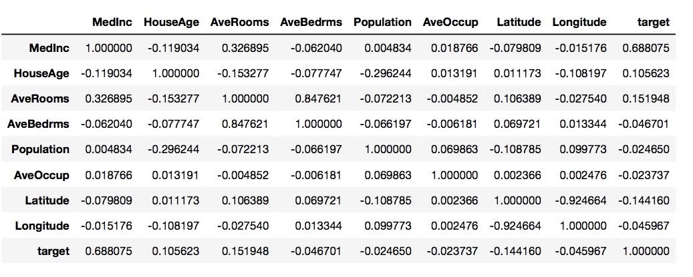

## Midterm Correction 

First we need to import the necessary libraries and the california housing data file: 

```
import numpy as np
import pandas as pd
from sklearn.linear_model import LinearRegression
from sklearn.model_selection import KFold
from sklearn.model_selection import train_test_split as tts
from sklearn.preprocessing import StandardScaler as SS
from sklearn.datasets import fetch_california_housing
from sklearn.linear_model import Ridge
from sklearn.linear_model import Lasso
from sklearn.metrics import mean_squared_error
```

Then we transform the california housing data into a data frame:

```
data = fetch_california_housing()

housing = pd.DataFrame(data.data)
housing.columns = data.feature_names
housing['target'] = data.target

X = np.array(housing.iloc[:, :8])
y = np.array(housing['target'])
```

Define the DoKFold function: 

```
def DoKFold(model, your_feature_obj, your_target_obj, k, standardize = False, random_state = 146):
    kf = KFold(n_splits=k, shuffle=True, random_state=random_state)

    if standardize:
        ss = SS()

    # add an object for your training scores
    train_score = []
    # add an object for your testing scores
    test_score = []
    # add an object for your training MSE
    train_mse = []
    # add an object for your testing MSE
    test_mse = []

    # add your for loop where you create idxTrain & idxTest using kf.split with your features
    for idxTrain, idxTest in kf.split(X):
        Xtrain = X[idxTrain, :]
        Xtest = X[idxTest, :]
        ytrain = y[idxTrain]
        ytest = y[idxTest]

        if standardize:
            Xtrain = ss.fit_transform(Xtrain)
            Xtest = ss.fit_transform(Xtest)
            
        # fit your model on this line using your training data
        model.fit(Xtrain, ytrain)
        
        train_score.append(model.score(Xtrain, ytrain))        
        # use your feature and target testing data to calculate your model score and append it to the test score object
        test_score.append(model.score(Xtest, ytest))
        
        #y_train_predict = model.predict(Xtrain)
        #y_test_predict = model.predict(Xtest)

        #train_mse.append(mean_squared_error(ytrain, y_train_predict))
        #test_mse.append(mean_squared_error(ytest, y_test_predict))
        
        #train_mse.append(np.mean((ytrain - y_train_predict) ** 2))
        #test_mse.append(np.mean((ytest - y_test_predict) ** 2))
        
    return train_score,test_score,train_mse,test_mse
```


### Question 15

In order to find the most correlated variable to the target, we can run through every feature in X by using the method `corr.()`. 

```
housing.corr()
```



From the data frame above, we can tell that MedInc is the most correlated variable to the target because it has the highest score of approximately 0.688. 


### Question 16 

If we standardize all of the features in the housing data frame, the correlations we identify in the previous question will not change. 

First, we would want to make a copy of the original housing data frame, so we will not directly modify the original housing data frame. Then we assign the copied data frame to `housing_ss`. Next we use `fit_transform` to fit and transform the features. Last, we use the `corr()` method again to see the correlations between each variable and the target. Below is the illustration of the standardization process: 

```
ss = SS()
housing_ss = housing.copy()
ss.fit_transform(housing_ss.iloc[:, :8])
housing_ss.corr()
```

### Question 17

To find the correlation of determination for MedInc and the target, I first assigned a new variable called `X2` containing only the data from MedInc. Since I am using a single feature of MedInc, I have to reshape it by using `reshape(-1,1)`. Then I can use the fit and score method to get the R squared. 

```
lin_reg = LinearRegression()
X2 = np.array(housing.iloc[:,0])
X2 = X2.reshape(-1, 1)

lin_reg.fit(X2,y)
lin_reg.score(X2,y)
```

The other way to compute the correlation of determination: 

```
np.round(np.corrcoef(housing['MedInc'],y)[0][1]**2, 2)
```

Both of the commands produce a value of 0.47 as the R squared value for MedInc and the target. 


### Question 18

To get the average test score using linear regression, we can make use of the DoKFold function we defined above. We need to plug in k=20 and standardize = True). The result is 0.60198. 

```
lin_reg = LinearRegression()
train_score, test_score, mse_train, mse_test = DoKFold(lin_reg, X, y, 20, standardize = True)
print(np.mean(train_score))
print(np.mean(test_score))
```

### Question 19

To use Ridge regression, we first need to define a range using the command  `a_range = np.linspace(20, 30, 101)`. We also have to set k = 20 and standardize = True in the DoKFold function. 

```
a_range = np.linspace(20, 30, 101)

k = 20

avg_tr_score=[]
avg_te_score=[]

for a in a_range:
    rid_reg = Ridge(alpha=a)
    train_scores,test_scores = DoKFold(rid_reg,X,y,k,standardize=True)
    avg_tr_score.append(np.mean(train_scores))
    avg_te_score.append(np.mean(test_scores))
    
idx = np.argmax(avg_te_score)
print('Optimal alpha value: ' + format(a_range[idx], '.5f'))
print('Training score for this value: ' + format(avg_tr_score[idx],'.5f'))
print('Testing score for this value: ' + format(avg_te_score[idx], '.5f'))
```

The result for the average testing score using Ridge regression is 0.60201. 

### Question 20

To use Lasso regression to obtain the average testing score, we can still use the DoKFold function. The only things we need to do is to set a different range by using the command `a_range = np.linspace(0.001, 0.003, 101)` and replace Ridge regression with Lasso regression. 

```
a_range = np.linspace(0.001, 0.003, 101)

k = 20

avg_tr_score=[]
avg_te_score=[]

for a in a_range:
    las_reg = Lasso(alpha=a)
    train_scores,test_scores = DoKFold(las_reg,X,y,k,standardize=True)
    avg_tr_score.append(np.mean(train_scores))
    avg_te_score.append(np.mean(test_scores))

idx = np.argmax(avg_te_score)
print('Optimal alpha value: ' + format(a_range[idx], '.5f'))
print('Training score for this value: ' + format(avg_tr_score[idx],'.5f'))
print('Testing score for this value: ' + format(avg_te_score[idx], '.5f'))
```

The result for the average testing score using Lasso regression is 0.60213. 

### Question 21

To standardize the entire dataset, we need to use the `ss.fit_transorm` method again. 

```
ss = SS()
X_ss = ss.fit_transform(X)
```

After standardization, we can now proceed with the fitting process using linear, ridge, lasso regression. 

```
lin_reg = LinearRegression()
lin = lin_reg.fit(X_trans, y)

rid_reg = Ridge(alpha=25.8)
rid = rid_reg.fit(X_trans, y)

las_reg = Lasso(alpha=0.00186)
las = las_reg.fit(X_trans, y)
```

After doing the fitting, we can use the `coef_` method to get the correlation coefficient for each of the regression models. According to the data frame we created for question 15, we learn that the least correlated variable to the target y is AveOccup. Since the index of AveOccup in the housing data frame is 5, we need to place 5 in the bracket for the `coef_` method. 

```
print(lin.coef_[5], rid.coef_[5], las.coef_[5])
```

From the results, we learn that Lasso regression produces the smallest score. 

### Question 22

This question uses the same logic from the previous question, but we need to find the correlation coefficient for the most correlated variable to the target y. By looking at the data frame in question 15, we learn that MedInc is the most correlated feature to the target and its index is 0. 

```
print(lin.coef_[0],rid.coef_[0],las.coef_[0]) 
```

According to the results, Lasso regression once again produces the smallest correlation coefficient. 

### Question 23 

Instead of R squared, we now use MSE when using ridge regression. One thing to note is that the optimal value for MSE is the smallest, not the biggest. Therefore, we use the command `idx = np.argmin(rid_te_mse)` instead of `np.argmax()` since we want to minimize the value. The rest of the codes is pretty much the same as what we did in question 19. 

```
a_range = np.linspace(20, 30, 101)

k = 20

avg_tr_score=[]
avg_te_score=[]
avg_tr_mse = []
avg_te_mse = []

for a in a_range:
    rid_reg = Ridge(alpha=a)
    train_scores,test_scores, train_mse, test_mse = DoKFold(rid_reg,X,y,k)
    avg_tr_score.append(np.mean(train_scores))
    avg_te_score.append(np.mean(test_scores))
    avg_tr_mse.append(np.mean(train_mse))
    avg_te_mse.append(np.mean(test_mse))

idx = np.argmin(avg_te_mse)
print(avg_tr_score[idx], avg_te_score[idx], avg_tr_mse[idx], avg_te_mse[idx])
print('Optimal alpha value: ' + format(a_range[idx], '.3f'))
```

The optimal value I obtained by using MSE is different from the one using R squared. The optimal value in this case is 26.1 while it is 25.8 when using R squared. 

### Question 24 


To find the optimal value for Lasso regression using MSE, we also need to modify the codes using `idx = np.argmin(las_te_mse)` since the smaller the MSE, the better. 

```
a_range = np.linspace(0.001, 0.003, 101)

k = 20

avg_tr_score=[]
avg_te_score=[]
avg_tr_mse = []
avg_te_mse = []

for a in a_range:
    las_reg = Lasso(alpha=a)
    train_scores,test_scores, train_mse, test_mse = DoKFold(las_reg,X,y,k)
    avg_tr_score.append(np.mean(train_scores))
    avg_te_score.append(np.mean(test_scores))
    avg_tr_mse.append(np.mean(train_mse))
    avg_te_mse.append(np.mean(test_mse))

idx = np.argmin(avg_te_mse)
print(avg_tr_score[idx], avg_te_score[idx], avg_tr_mse[idx], avg_te_mse[idx])
print('Optimal alpha value: ' + format(a_range[idx], '.3f'))
```

The optimal values using MSE and R squared for Lasso regression are both 0.00186. 

### Final Reflection 

I got everything right for the midterm. I probably struggled most with how to implement MSE when doing regression, but later I figured out it was because I forgot to minimize MSE. Overall, the midterm was quite challenging for me. 


