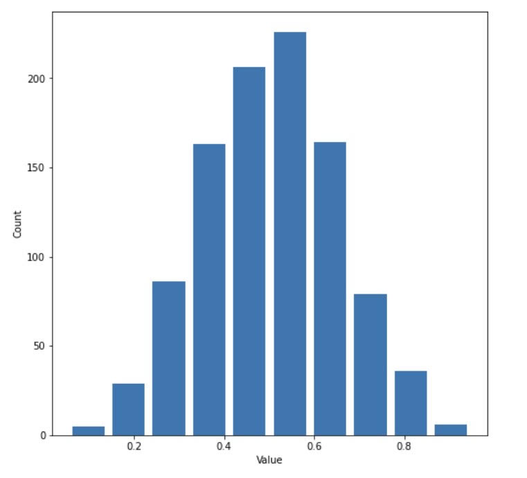

# Project 2

### Question 1 

Continuous data is a type of numeric data that can take any value within a range. They can be measured on a continuum, but they cannot be counted. Examples of continuous data include height and income. Ordinal data is also numeric, but the difference between continuous and ordinal data is that the latter only concerns the order of the ordinal values. One example of ordinal data can be a list of top 10 best-selling books of the month. Nominal data is a type of categorical data which is non-numerical and without orders. Nominal data is similar to labels and it can be the names of colors and races. 

Below is a model of my own construction that incorporates variables of continuous, ordinal, and nominal data: 

An example can be a linear regression model based on two independent variables of race and income and the dependent variable of the satisfaction level of living quality. 
The type of race (nominal) one belongs to and the amount of income (continuous) one earns are features that can be used to predict the target which is the satisfaction level of living quality (ordinal) in the United States. In this model, we can think of the satisfaction level of living quality on a scale of 1 to 10 where 1 represents the least satisfaction and 10 the greatest satisfaction. For example, Asians might be more easily subject to violence arising from racial discrimination than Whites, which affects their satisfaction level in terms of living in the United States. Also, the amount of income also plays a key role in determining one’s living quality because the more you earn the more you can spend your money on things that make your life easier and happier. Thus, if you belong to the Asian race and you earn a meager income, it is highly likely that you score between 1 to 5 on the scale of satisfaction level of living quality. 

### Question 2 

In order to generate a data set of 1000 observations, we can use the command `np.random.beta(a, b, size=n)` where `n=1000`. To use the beta distribution to produce a plot that has a mean approximating the 50th percentile, we need to set alpha=beta. In this case, I set alpha=beta=5, so we can see a clear symmetry in the plot. The mean is 0.5028037973206971 and the median is 0.5064511906342577, which are extremely close to each other. 

When the beta is larger than the alpha, the mean of the beta distribution will be greater than the median. Below we can see a right-skewed distribution with alpha=2 and beta=6. The mean is 0.2556567993697229 and the median is 0.23877827678745545. 

When the beta is smaller than the alpha, the mean of the beta distribution will be smaller than the median, which shows a left-skewed distribution. In this case, I set alpha=6 and beta=2, which produces a mean of 0.7500593503731386 and a median of 0.7694370145250353. 

### Question 3 

From both of the histograms generated using the raw data and log transformation, we can clearly see that the majority of countries shift to the right, meaning the life expectancy for these countries increases from 1952 to 2007. It is obvious that the mean and the median for the year of 2007 are significantly higher than those of the year of 1952. By using the command `np.mean(df2007['lifeExp'])` and `np.median(df2007['lifeExp'])`, we can learn that the mean of life expectancy in 2007 is 67.00742253521126 and the median is 71.93549999999999, indicating that it is left-skewed. 

Raw Data Plot:

Logarithmic Plot:

Both plots illustrate an obvious shift to the right, but I think the raw data one, with the ages shown on the x axis, is preferred for the fact that it reflects the growth of life expectancy more directly.  

### Question 4 

Raw Data Plot:

Logarithmic Plot:

The log transformed box and whisker plot performs better at communicating the change in population amongst all of these countries from 1952 to 2007. In the raw data plot, we can clearly see that there are outliers increasing year by year, but the actual boxes are extremely squeezed at the bottom of the plot. This makes analyzing the change in population difficult because we are unable to spot an obvious difference between each year. The cause of such a case is that the outliers deviate significantly away from the mean and the median. On the other hand, the log transformed plot is able to show us the boxes clearly as well as the trend of growing population. 

