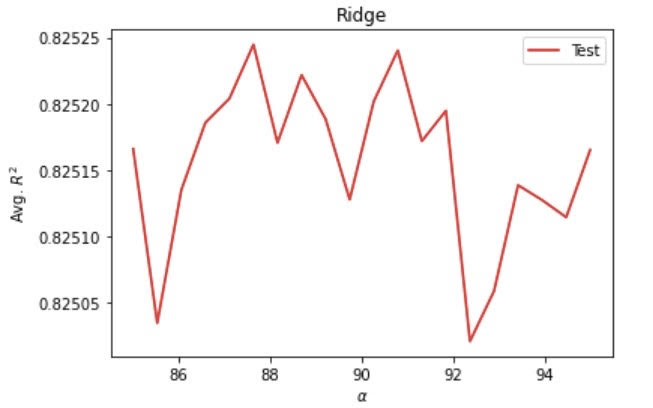
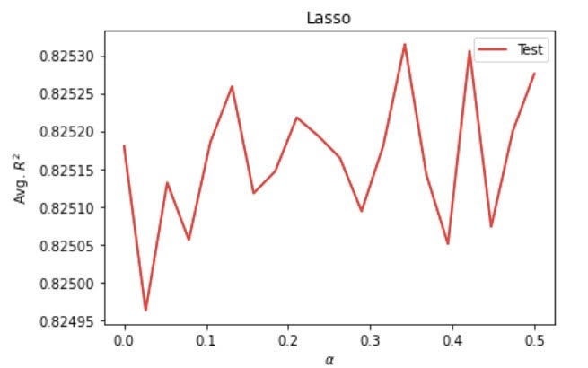

## Project 5

### Question 1 
First, we need to import the file `persons.csv` by using the command `df = pd.read_csv("persons.csv")`. By using `df.isnull().values.any()`, I found out that there are NaNs that needed to be removed. Then I used `df.dropna(inplace=True)` to remove all the NaNs. Observing the data frame again, I noticed that the number of rows decreased from 47974 to 47891, which is not a significant drop, so it would not influence the data too much. Also, we need to change the type of some features. By using `display(df.dtypes)`, I found out that the “age” and “edu” features are both in the type of float. Thus, I utilized the `astype` method to convert them into `int` by using the command  `df["age"]=df["age"].astype(int)` and the same thing for “edu.” Next, we need to assign the features to `x` and target to `y`. One thing to note here is that we would want to also drop the feature of `wealthI` along with `wealthC` when assigning `x`. 

```
df = pd.read_csv("persons.csv")

df.dropna(inplace=True)
df.isnull().values.any()

df["age"]=df["age"].astype(int)
df["edu"]=df["edu"].astype(int)

X = df.drop(["wealthC", "wealthI"],axis=1)
y = df.wealthC
```

### Question 2 
Using linear regression, the MSE I produced without the standardization of features is `0.4428100784152544`.
The R squared value is `0.7358226925730342`.
The coefficient the linear regression model without standardization is: 
```
array([ 3.01812923e-02,  1.07882853e-02, -5.57603897e-04,  8.37880684e-02,
        4.04701739e-02,  6.37198352e-02, -1.40023112e-01,  9.99896825e-02,
        1.85515805e-01, -2.49517259e-01, -2.47122665e-01, -7.30324831e-02,
        3.09612080e-01, -1.29375995e-01,  3.53607318e-01,  2.33225714e-01,
       -1.34364084e-01, -1.92558301e-01, -1.20146711e-01,  3.59279100e-02,
        1.46004504e-01, -1.81932414e-01,  1.05944573e-01,  4.00186663e-01,
        1.72822325e-01,  2.29943453e-02,  1.03043774e-01, -1.15888783e-01,
       -2.18966624e-01, -2.90949455e-01, -3.83672661e-01, -3.84737293e-01,
        3.07519898e-01,  2.55401258e-02,  2.56163113e-01,  3.95033383e-01,
        3.60442298e-01,  1.90435535e-01,  3.86891012e-01,  1.53405264e-01,
       -2.09042764e-02,  5.43122461e-02, -1.27172669e-01, -5.40268677e-01,
       -5.63637093e-01, -1.58355761e-01, -1.08923385e-01, -2.12578757e-02,
       -3.26132080e-01,  3.26132080e-01, -6.44297719e-02,  6.44297719e-02,
       -2.76390443e-01,  4.32693258e-01,  6.03439291e-02,  4.07576086e-01,
       -6.37787977e-01,  1.35651470e-02, -2.47897601e-01,  2.47897601e-01])
 ```
       
After standardization, the values of MSE and R squared are approximately the same with those generated by the linear regression model without standardization. However, the coefficients of the standardized model are smaller than those of the unstandardized ones. 
The coefficient of the standardized linear regression model is:
```
array([ 1.12548658e-01  5.24358116e-03 -1.08884589e-02  6.92579735e-02
  7.36951509e+10  8.66257201e+10  7.69209583e+10  7.91372426e+10
  8.45473781e+10  7.89854838e+10  7.88333540e+10  8.76583681e+10
  8.66134726e+10  8.54267349e+10  1.16140874e+11  1.01070442e+11
  7.65053798e+10  7.51091695e+10  8.19133567e+10  4.80000747e+10
  7.26531241e+10  7.87003037e+10 -6.56609287e+09 -6.60161265e+09
 -1.20447035e+10 -1.40140921e+10 -7.23238899e+10 -3.56557715e+10
 -1.50138208e+10 -2.23537221e+10 -6.34833466e+10 -4.69533271e+09
 -7.80211026e+09 -1.23673099e+10 -1.59629508e+10  5.30991560e+10
  2.31813714e+11  8.95044996e+10  4.32553262e+10  1.67206073e+10
  3.49539754e+11  2.11161816e+11  2.27988135e+11  4.41825617e+11
  1.81354767e+10  2.62747629e+10  1.66594092e+11  3.43909538e+10
 -2.42890031e+11 -2.42890031e+11  1.82248582e+10  1.82248582e+10
  1.21238081e+10  5.65381739e+09  1.10197079e+10  2.38345511e+11
  2.39952072e+11  3.49669495e+10 -4.32651302e+10 -4.32651302e+10])
```

From the results we produced above, we can tell that standardizing the features actually made coefficients drop significantly while the MSE and R squared values barely changed. 

### Question 3 

Using the ridge regression, I  set the range from 70 to 75 and the number of fold to 20. This produced an optimal alpha value of `70.78947368421052`, a training score of `0.7358355438535896`, and a testing score of `0.7351783600963877`. Compared with the scores produced by the linear regression model, the results produced by the ridge regression have seen a slight improvement, but the improvement only shows after the 4th decimal place. 

### Question 4 

Using the lasso regression, I set the range from 0 to 0.5 and the number of folds to 20 to keep it consistent with the other models. This produced an optimal alpha value of `0`, a training score of `0.7358355537426604`, and a testing score of `0.7351336602401048`. I was unsure at first if yielding a 0 as the optimal alpha value is normal. However, running for multiple times, I was still getting the same value of 0. Compared to the results produced by the linear regression model, we can also see an improvement, but it only appears after the 4th decimal place. 

### Question 5 

With wealthI as the target, the linear regression model without standardization produced a MSE as high as `1750276834.930475`, a training R squared value of `0.8258275464590519`, and a testing R squared value of `0.8252769318036336`. And the coefficient for the model is: 
```
array([ 2.31986195e+03,  1.08192000e+03, -5.08892487e+01,  6.53283809e+03,
        3.17688859e+03,  4.03623951e+03, -9.96051610e+03,  1.12302854e+04,
        1.02336910e+04, -1.62924258e+04, -1.71918653e+04, -6.04206999e+03,
        2.08751277e+04, -9.31120042e+03,  2.41734580e+04,  1.34930387e+04,
       -6.80151578e+03, -1.25300357e+04, -9.08909982e+03,  5.48192929e+03,
        7.99367502e+03, -1.34756043e+04,  1.74439055e+04,  3.27144540e+04,
        5.76665872e+03,  3.89473708e+02,  2.46689944e+03, -1.29356339e+04,
       -1.29054696e+04, -2.77376917e+04, -2.95652191e+04, -2.65078796e+04,
        2.29944393e+04, -3.88963009e+03,  3.17656932e+04,  4.00606955e+04,
        3.66535576e+04,  9.64026616e+03,  4.80974344e+04,  9.98177625e+03,
       -1.07028288e+04, -9.12002749e+03, -1.86232403e+04, -4.61832386e+04,
       -3.14138344e+04, -7.19146447e+03, -1.55796604e+04, -5.61943537e+03,
       -3.46563978e+04,  3.46563978e+04, -3.20570735e+04,  3.20570735e+04,
        1.51485651e+03,  5.89549456e+04,  2.36376276e+04,  9.41611219e+03,
       -6.81569745e+04, -2.53665673e+04, -2.24372689e+04,  2.24372689e+04])
```

After standardizing the linear regression model, the values of MSE and R squared barely changed. The values of MSE and R squared are `1750288550.4740968` and `0.8258260281336447` respectively. The coefficient of the linear regression model with standardization is: 
```
array([ 8.64993728e+03  5.31704713e+02 -1.00083919e+03  5.39975577e+03
  5.08584139e+15  5.97820436e+15  5.30846044e+15  5.46141040e+15
  5.83477406e+15  5.45093724e+15  5.44043848e+15  6.04946935e+15
  5.97735914e+15  5.89546013e+15  8.01510082e+15  6.97506186e+15
  5.27978059e+15  5.18342548e+15  5.65299528e+15  3.31257571e+15
  5.01392915e+15  5.43125643e+15 -4.53138456e+14 -4.55589743e+14
 -8.31227714e+14 -9.67138936e+14 -4.99120808e+15 -2.46067205e+15
 -1.03613210e+15 -1.54267253e+15 -4.38110551e+15 -3.24033768e+14
 -5.38438348e+14 -8.53491387e+14 -1.10163335e+15  3.66447293e+15
  1.59979017e+16  6.17687436e+15  2.98513166e+15  1.15392065e+15
  2.41223979e+16  1.45726753e+16  1.57338913e+16  3.04912193e+16
  1.25156346e+15  1.81327095e+15  1.14969726e+16  2.37338460e+15
 -1.67622992e+16 -1.67622992e+16  1.25773184e+15  1.25773184e+15
  8.36686869e+14  3.90180604e+14  7.60490828e+14  1.64486734e+16
  1.65595452e+16  2.41313515e+15 -2.98580826e+15 -2.98580826e+15])
```

From the above models using linear regression, we can see that the R squared value has increased in comparison with that of using `wealthC`, but the problem is that we now have extremely huge MSE which is not a positive sign for model prediction. Also, while the coefficients changed significantly, the values of MSE and R squared stay approximately the same. 

Running a ridge regression model, I set the range from 85 to 95 and the number of folds to 20. This produced an optimal alpha value of `88.15789473684211`, a training score of `0.8258366475526164`, and a testing score of `0.8253087200542343`. 

Running a lasso regression model, I set the range from 0 to 0.5 and the number of folds to 20. This produced an optimal alpha value of `0.3421052631578947`, a training score of `0.8258367743818826`, and a testing score of `0.825314711449513`. 


### Question 6 

Overall, there is much to take into consideration to identify the best model. In terms of R squared, all three kinds of models using `wealthI` have consistently higher values for training and testing scores than those using `wealthC`. This indicates that `wealthI` is a more correlated variable to the other variables in the `persons.csv` data set than `wealthC`, making it more suitable for predicting the wealth level for all people in the West African country. I had a concern regarding using `wealthI` though since it generates extremely large MSE, but right now I would assume R squared as a more important indicator than MSE when choosing the best model. Therefore, I think the models that produce the best results are the ridge and lasso regression models using `wealthI` since they generate about the same as well as the highest training and testing scores among all of the models for both `wealthC` and `wealthI`. 

Below are the ridge and lasso regression models with `wealthI` as the target.








