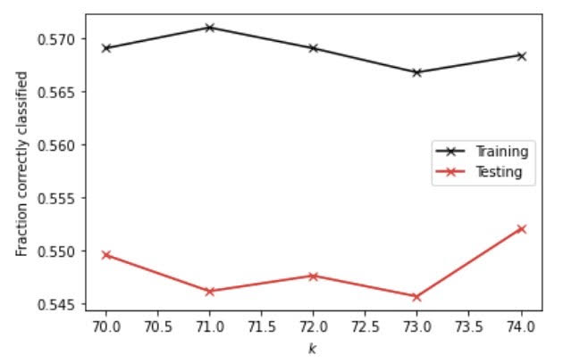
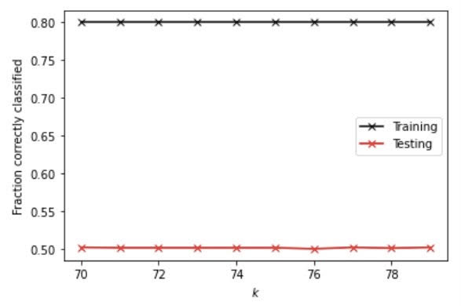
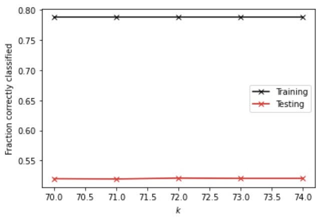
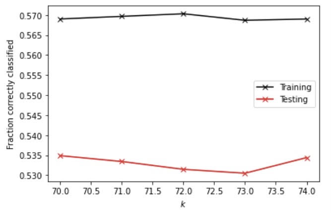

Importing the libraries and functions:

```
import matplotlib.pyplot as plt
import numpy as np
import pandas as pd

from sklearn.model_selection import KFold
from sklearn.preprocessing import StandardScaler as SS
from sklearn.model_selection import train_test_split as tts
from sklearn.neighbors import KNeighborsClassifier as KNN
```

Define the DoKFold, GetData, and CompareClasses functions: 

```
def DoKFold(model, X, y, k, random_state=146, scaler=None):
   
    from sklearn.model_selection import KFold
    kf = KFold(n_splits=k, shuffle=True, random_state=random_state)

    train_scores = []
    test_scores = []
    train_mse = []
    test_mse = []

    for idxTrain, idxTest in kf.split(X):
        Xtrain = X[idxTrain, :]
        Xtest = X[idxTest, :]
        ytrain = y[idxTrain]
        ytest = y[idxTest]

        if scaler != None:
            Xtrain = scaler.fit_transform(Xtrain)
            Xtest = scaler.transform(Xtest)

        model.fit(Xtrain, ytrain)

        train_scores.append(model.score(Xtrain, ytrain))
        test_scores.append(model.score(Xtest, ytest))

        # Compute the mean squared errors
        ytrain_pred = model.predict(Xtrain)
        ytest_pred = model.predict(Xtest)
        train_mse.append(np.mean((ytrain - ytrain_pred) ** 2))
        test_mse.append(np.mean((ytest - ytest_pred) ** 2))

    return train_scores, test_scores, train_mse, test_mse
 ```
 ```
 def GetData(scale=False):
    Xtrain, Xtest, ytrain, ytest = tts(X, y, test_size=0.4)
    ss = StandardScaler()
    if scale:
        Xtrain = ss.fit_transform(Xtrain)
        Xtest = ss.transform(Xtest)
    return Xtrain, Xtest, ytrain, ytest
 ```
 ```
 def CompareClasses(actual, predicted, names=None):
    accuracy = sum(actual == predicted) / actual.shape[0]
    classes = pd.DataFrame(columns=['Actual', 'Predicted'])
    classes['Actual'] = actual
    classes['Predicted'] = predicted
    conf_mat = pd.crosstab(classes['Predicted'], classes['Actual'])
    if type(names) != type(None):
        conf_mat.index = y_names
        conf_mat.index.name = 'Predicted'
        conf_mat.columns = y_names
        conf_mat.columns.name = 'Actual'
    print('Accuracy = ' + format(accuracy, '.2f'))
    return conf_mat, accuracy
```
We also need to do some preliminary work to clean the data set `city_person.csv`. The cleaning work on `city_person.csv` is similar to what we did on the previous project. First, we need to remove the NaNs, and then convert the type of the education and the age features into ints. Next, we have to assign anything other than wealthC to X and wealthC to y. 

```
pns = pd.read_csv("city_persons.csv")

pns.dropna(inplace=True)

pns['age'] = pns['age'].astype(int)
pns['edu'] = pns['edu'].astype(int)

X = pns.drop(["wealthC"], axis=1)
y = pns.wealthC
```

### Question 1 

Executing the K-nearsest neighbors classification, I used a narrower range of 70 to 75 and found out that with 74, it generates the highest testing score. The testing score I got is 0.5519765739385066. I also plotted the KNN model out to better visualize it. And from the graph, we can tell that at an alpha value of 74, the testing score is the closest to the training score, which indicates that it produces the least overfit within the range from 70 to 75. Also, at 74, the fraction correctly classified scores the highest. 



We can also add a distance weight to see if it helps classify better. With the distance weight, the best alpha value is 70 and the testing score is 0.5017081503172279, which is lower than that of using no distance. 



### Question 2 

To use logistic regression, I got a testing score of 0.5568570034163006, which is higher than that of an unweighted KNN model. Also, the training and testing scores using logistic regresssion are really close and the testing score is even higher than the training score, which suggests that there isn't an overfit but only a very slight underfit. 


### Question 3 

Next, I used a random forest model and set the estimators to 100, 500, 1000, 5000 and execute the model on both raw and scaled data. 

Here are the training and testing scores for the raw data:
```
[0.7926432291666666, 0.5017081503172279]
[0.7926432291666666, 0.49487554904831627]
[0.7926432291666666, 0.49731576378721326]
[0.7926432291666666, 0.5036603221083455]
```
Here are the training and testing scores for the standardized data: 
```
[0.79296875, 0.4826744753538311]
[0.79296875, 0.486090775988287]
[0.79296875, 0.4890190336749634]
[0.79296875, 0.48560273304050755]
```
The best result for the unstandardized data is produced with a 5000 estimator and the best result for standardized data is produced by a 1000 estimator. From the results of both the unstandardized and standardized data, there are huge gaps between the training and the testing scores with the former higher than the latter, suggesting an overfit. Also, I found out that the minimum samples required to split an internal node using a range of 20 to 30 is 22.

### Question 4 

After recoding the wealth classes 2 and 3 into a single outcome, I redid all of the different models. 

First I ran the KNN model with and without the weighted distance. With the distance weight, at the optimal alpha value of 70, I got a testing score of 0.5348950707662274. 



Next, I added the distance weight into the KNN model. At the optimal alpha value of 72, I got a testing score of 0.5207418252806247. Once again, accuracy dropped after adding the distance since we produced a lower testing score. 



As for the logistic regression model, the training and testing scores are 0.5537109375 and 0.5597852611029771 respectively. In comparison with the scores produced by KNN with or without distance, the scores produced by the logistic regression model are higher, indicating a higher accuracy. 

Lastly, I used the random forest model on the recoded data with and without standardization. 
Here are the results for unstandardized data:
```
[0.77734375, 0.4826744753538311]
[0.77734375, 0.4924353343094192]
[0.77734375, 0.49487554904831627]
[0.77734375, 0.493411420204978]
```
Here are the results for the standardized data: 
```
[0.7698567708333334, 0.5148853099072719]
[0.7698567708333334, 0.51634943875061]
[0.7698567708333334, 0.5187896534895071]
[0.7698567708333334, 0.5124450951683748]
```
We can clearly see that standardization increases the accuracy a little bit, but there is also a quite obvious overfit for both the unstandardized and the standardized data using random forest. 

To summarize the changes among all of the models after recoding 2 and 3 into a single outcome, I found out that despite the fact that the testing accuracy does not significantly improve, but we can still see a slight increase in almost all of the models after recoding. Having taken a look at the `city_persons.csv` data, I noticed that within the wealthC column, there were significantly fewer 2 than 3, 4, and 5. Thus, I extrapolate that by combining 2 and 3 into a single value, we are able to reduce the variance in the data, thus increasing the accuracy. 

### Question 5 

In general, the best model is the logistic regression model after recoding 2 and 3 into a single value because it yields the highest testing score of 0.5597852611029771. On the other side, the random forest model without standardization is the least accurate model because the testing scores it produces are the lowest among all of the models and there are wide gaps between the training and testing scores, indicating an overfit. Thus, it is the most accurate predictor for wealth of all persons throughout the large West African capital city. To add on that, another advantage of the logistic regression model after recoding 2 and 3 into a single value is that it is not overfitting, so the results generated may be more reliable than other models. 


